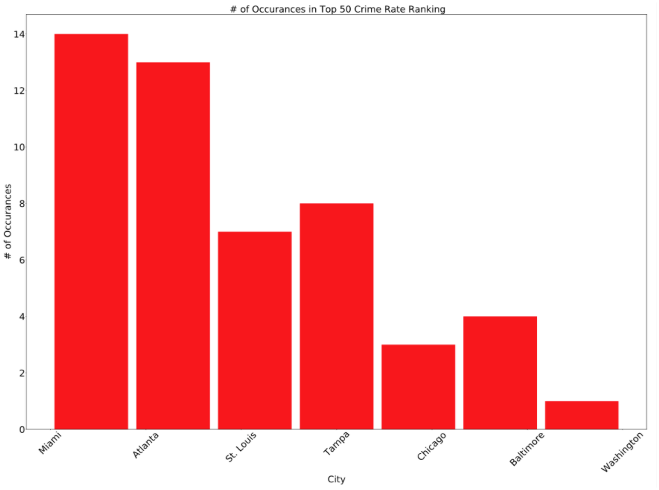
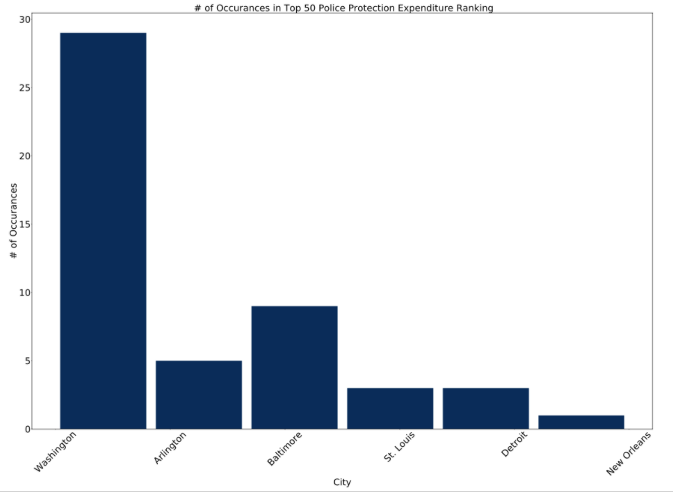
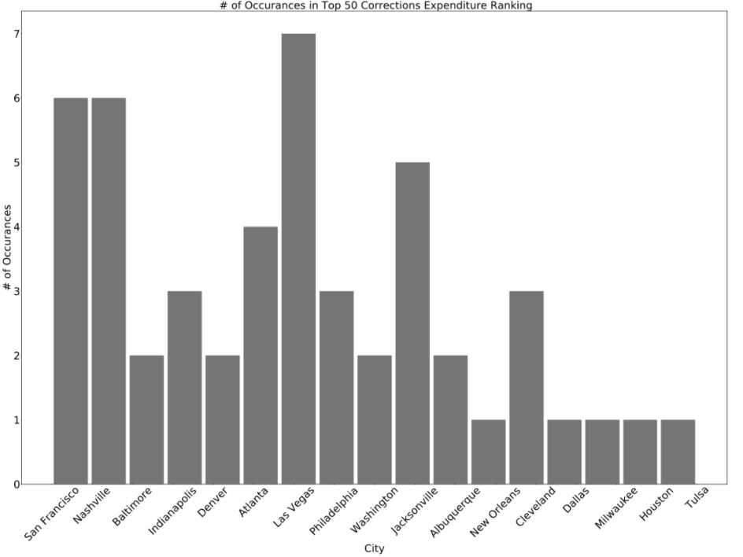
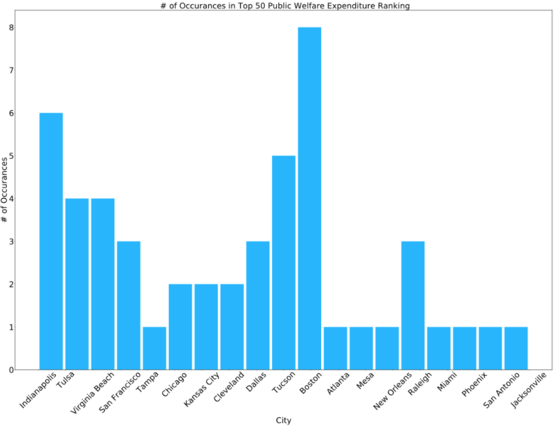
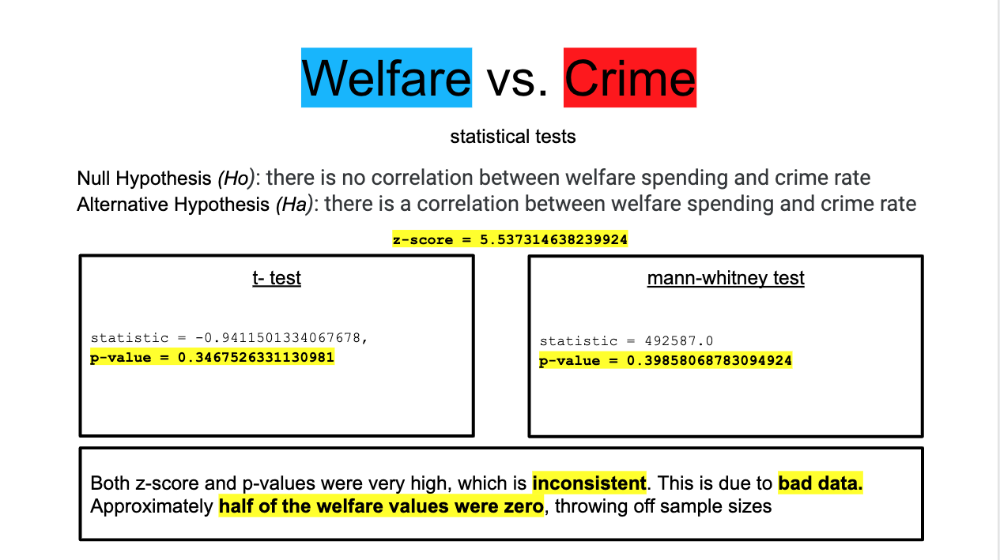
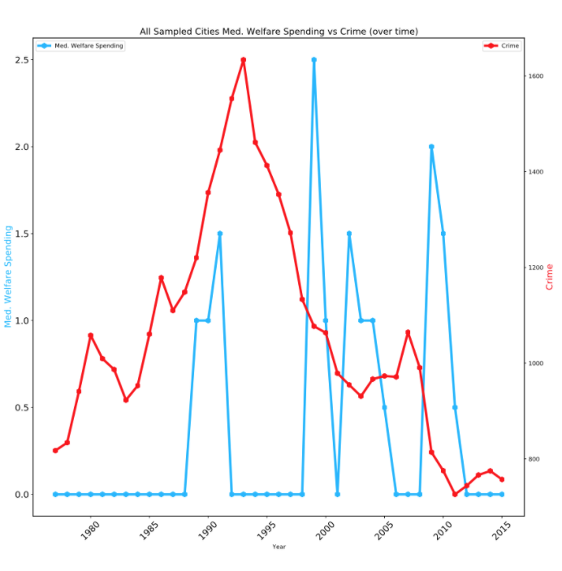
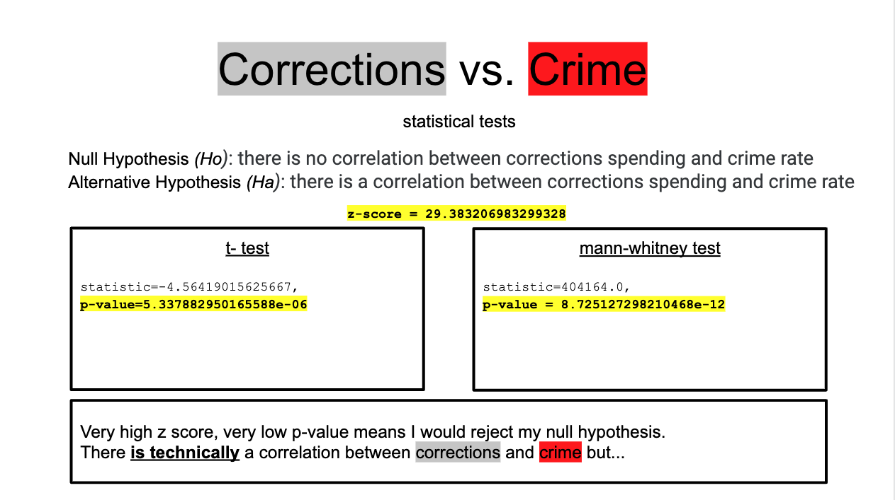
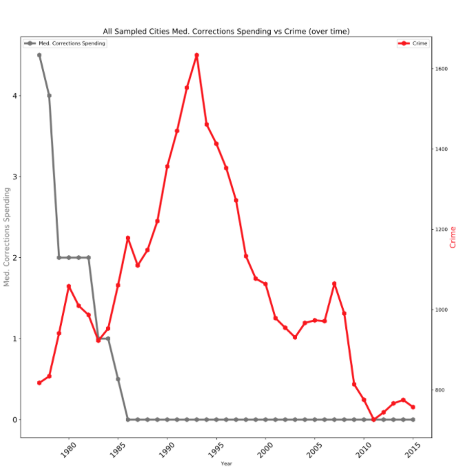
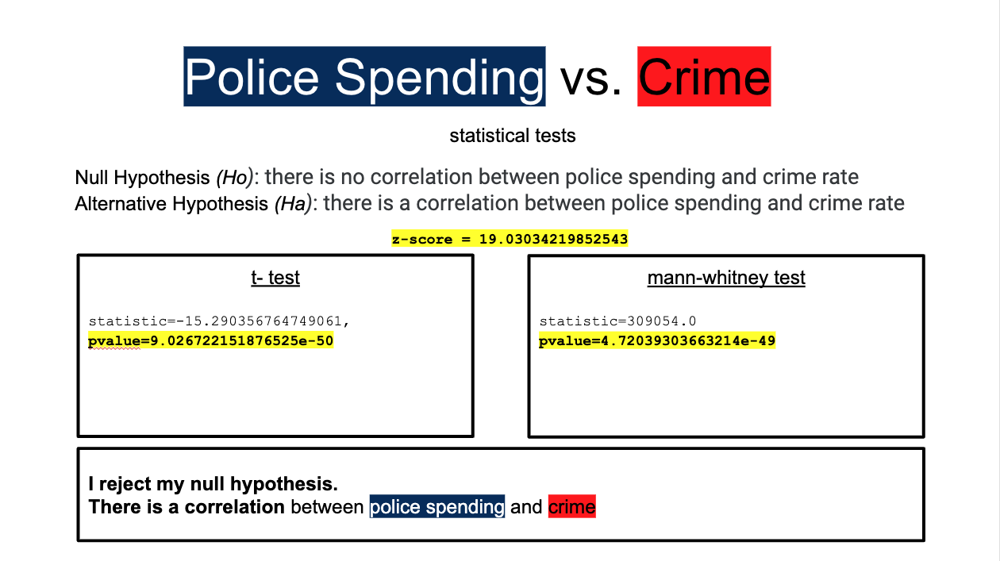
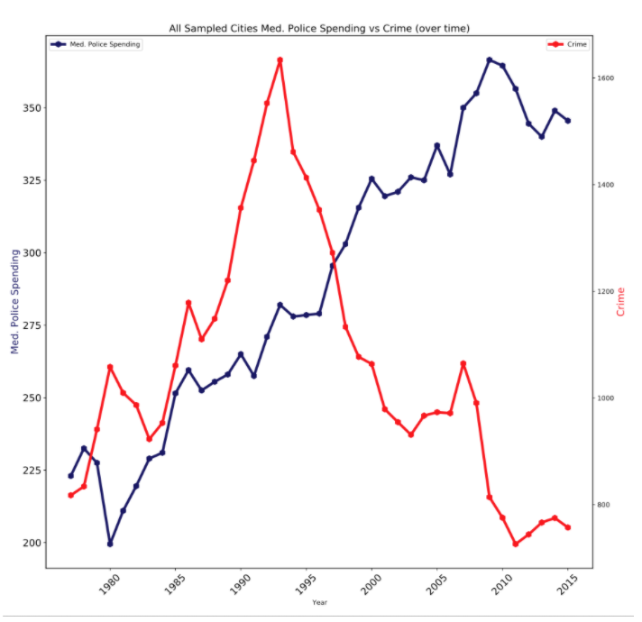

## Defund the Police?

After the horrific murder of George Floyd on May 25, 2020, Americans nationwide marched to protest the decades-long mistreatment of African Americans by law enforcement officials. From this movement came a large call to "Defund the Police", which implored city governments to move some amount of funds away from their police departments and toward [community resources like "social services, youth services, housing, education, and healthcare"](https://en.wikipedia.org/wiki/Defund_the_police). This made me ask the question...

## ...is there a coorelation between police spending and crime rate?

First I had to gather data. 

I found a .csv listing rates of homicide, rape, robbery and aggravated assault for 69 cities over 40 years. This file was from [The Marshall Project, a "nonprofit, online journalism organization focusing on issues related to criminal justice in the United States"](themarshallproject.org). From this data, I was able to derive a unique "crime rate" metric for every city and every year; adding up the totals of the four above crimes, dividing by population, and multiplying by 100,000. This calculation was taken from the [California Attorney General's Office website] (https://oag.ca.gov/sites/all/files/agweb/pdfs/cjsc/stats/computational_formulas.pdf). 

I also had to gather city government spending data, and was able to do so through [The Lincoln Institute of Land Policy, a Cambridge, MA thinktank that "seeks to improve quality of life through the effective use ... of land"](lincolninst.edu). The file included numbers on how much a city spent on welfare, corrections (jail), and police, and I was able to get data for 53 cities over 38 years.

I merged the two files into one DataFrame with Pandas, a data manipulation and analysis Python library, so I could easily navigate through the data. 

## Exploratory Data Analysis

Out of curiosity, I wanted to see which cities had consistently high crime rates from 1977 to 2015, the time-span of the merged data set. I did so by ranking the top 50 annual crime rates and seeing which cities showed up most in that ranking. 

I created the graph with MatPlotLib, a Python data visualization library, and it is shown below.

*Miami and Atlanta had consistenly high crime rates*

I also wanted to do the same for police spending, corrections spending, and welfare spending. Those three graphs are below.

*Washington DC might spend the most on its police since they need to work with federal government to protect the Capitol, White House, and other national monuments/museums*

*Las Vegas police may have to deal with a lot of out-of-towners who take the fun too far, and as a result, spend a lot on their corrections*

*Boston spends a lot on its welfare program(s)*

## Statistical Tests

I ran all six of these statistical tests using SciPy, a scientific computing library with Python.
The slides are from a Google Slides presentation.

*Welfare vs Crime*

First, I wanted to find the coorelation between welfare spending and crime rate. I ran a t-test and Mann Whitney Test, but because half the welfare data was unusable, the numbers were wildly inconsistent. I was not able to make a call whether or not to reject my null hypothesis. 

As expected, the graph trying to visualize this coorelation is unusable, since a lot of the blue data points are zero. The graph is very inconsistent and jagged. 

Next, I wanted to find the coorelation between corrections spending and crime rate. I again ran a t-test and Mann Whitney Test but because half the corrections data was also unusable, the numbers were inconsistent again. I was not able to make a call whether or not to reject my null hypothesis. 

As expected, the graph trying to visualize this coorelation is also unusable, since a lot of the gray data points are zero. This graph is very jagged as well.

*Police vs Crime*

Finally and most of all, I wanted to find the coorelation between police spending and crime rate. I ran a t-test and Mann Whitney Test, and because I had lots of valid data (99% of the data was usable), I was able to draw a conclusion and reject my null hypothesis.

The graph trying to visualize this coorelation makes perfect sense. As median police spending rises, median crime rate falls. 

## Conclusion

The notion that there's a coorelation between police spending and crime can't be ruled out. A reduction in police spending can certainly increase crime, and the data proving the usefulness of welfare isn't sufficient so far.

**Both our police systems as well as our unconsious biasses need lots of work, but the idea of "defunding the police" might need some more work too before it is put into practice.**
